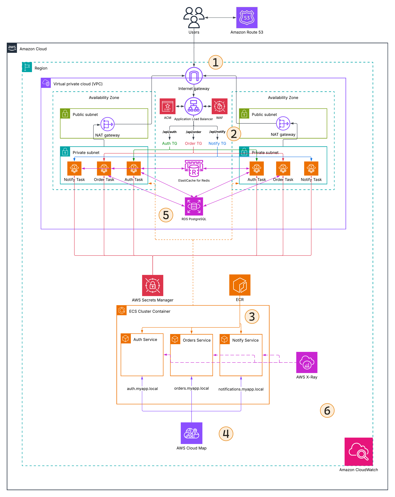
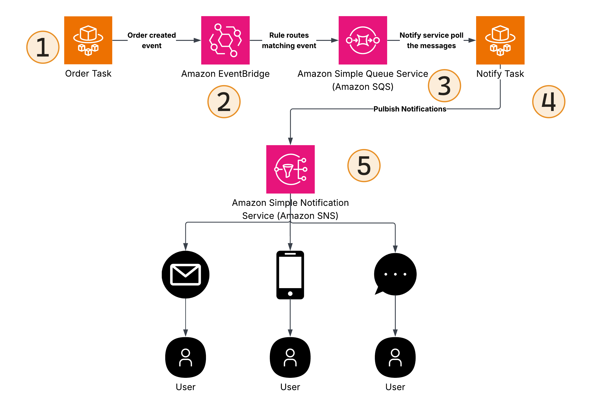
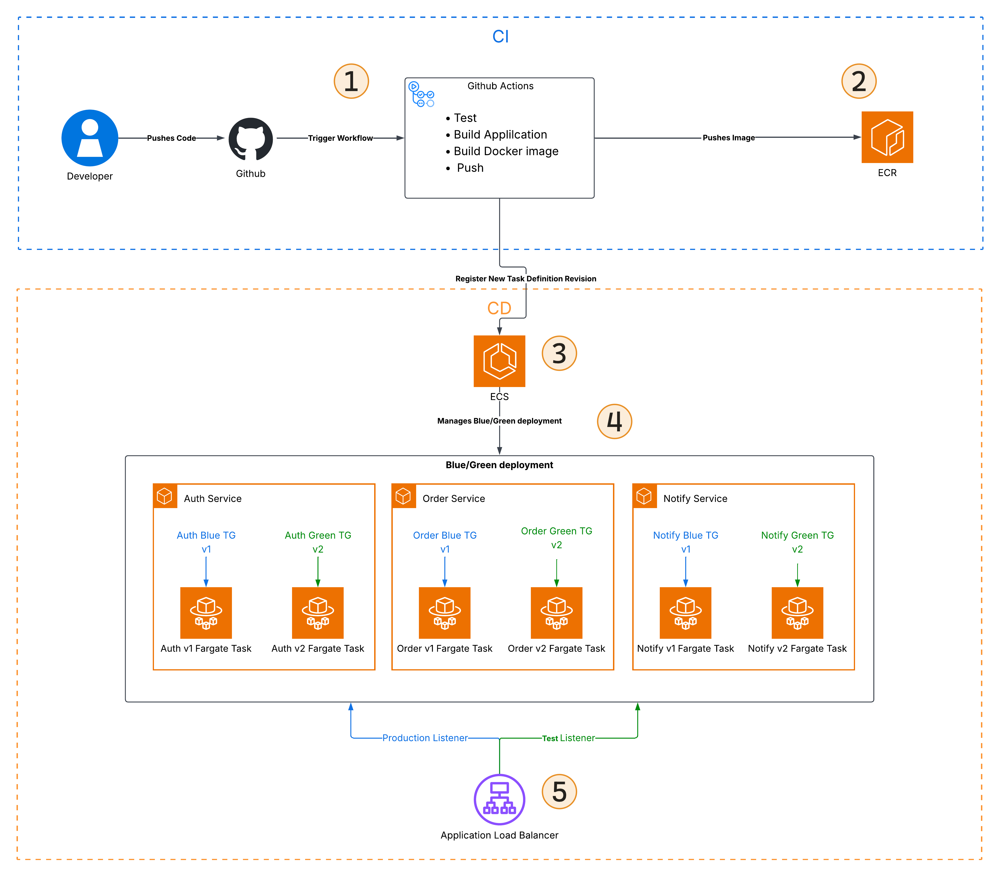
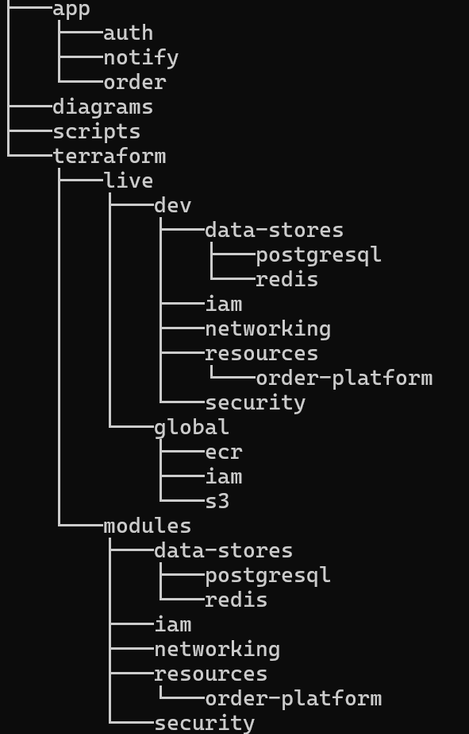

# Event-Driven Order Processing Platform

## Solution Overview

The Event-Driven Order Processing Platform provides a containerized backend for an online ordering application. It uses three microservices to handle authentication, order management, and notifications, with asynchronous event processing to keep services loosely coupled.

The platform is designed for high availability, scalability, secure communication, persistent data storage, and centralized monitoring. Infrastructure is managed with Terraform, while GitHub Actions automates container builds and ECS deployments using blue/green releases.

## Microservices

- **Auth Service:** Handles user authentication, authorization, and session management.
- **Orders Service:** Handles creating, retrieving, updating, and managing user orders.
- **Notifications Service:** Processes notification events and publishes notifications to subscribed delivery channels.

## AWS Services

### Networking & Application Access

- Amazon VPC
- Internet Gateway
- NAT Gateway
- Application Load Balancer
- Amazon Route 53
- AWS WAF
- AWS Certificate Manager

### Compute & Containers

- Amazon ECS
- AWS Fargate
- Amazon ECR

### Service Communication & Events

- AWS Cloud Map
- Amazon EventBridge
- Amazon SQS
- Amazon SNS

### Data & Secrets

- Amazon RDS for PostgreSQL
- Amazon ElastiCache for Redis
- AWS Secrets Manager

### Monitoring & Tracing

- Amazon CloudWatch
- AWS X-Ray

## Architecture



### Architecture Explanation

#### 1. Network & Secure Entry

The application runs inside an Amazon VPC spanning two Availability Zones. Each AZ contains a public subnet and a private subnet.

The public subnets contain the internet-facing ALB and a NAT Gateway. The Internet Gateway provides connectivity between the VPC and the internet, while the NAT Gateways allow resources in the private subnets to make outbound internet connections without exposing them directly to the internet.

Amazon Route 53 provides the application domain and resolves it to the ALB. The client then sends an HTTPS request to the ALB.

AWS WAF protects the ALB by filtering incoming web requests.
AWS ACM provides the TLS certificate used by the ALB HTTPS listener.

The Auth, Orders, and Notifications Fargate Tasks run in the private subnets across both AZs, keeping the application workloads isolated from direct internet access.

#### 2. Routing

The Application Load Balancer uses path-based routing to send requests to the correct microservice.

For example:

- `/api/auth` → Auth TG
- `/api/order` → Orders TG
- `/api/notify` → Notifications TG

Each target group routes requests to the corresponding Fargate Tasks. ALB health checks help ensure that traffic is sent only to healthy tasks.

#### 3. ECS & Fargate

Amazon ECS organizes and manages the Auth, Orders, and Notifications services. Each service maintains its required number of Fargate Tasks.

AWS Fargate runs the containers without requiring us to manage the underlying servers. The tasks are placed across the private subnets in both Availability Zones to improve availability and allow the services to scale.

Amazon ECR stores the Docker images used by the ECS services.

#### 4. Service Discovery

AWS Cloud Map provides private service discovery between the microservices. It is used because Fargate Tasks can be replaced or scaled, so services should not depend on fixed task IP addresses.

Each ECS Service is registered with a Cloud Map service and receives a private DNS name such as:

- `auth.myapp.local`
- `orders.myapp.local`
- `notifications.myapp.local`

For example, the Orders Service can use `auth.myapp.local` to communicate with the Auth Service.

#### 5. Data, Sessions & Secrets

Amazon RDS for PostgreSQL provides persistent storage for application data. The Auth Service uses it for user and account data, while the Orders Service uses it for order data.

Amazon ElastiCache for Redis provides a shared session store for the microservices. Session data is kept outside the Fargate Tasks so the services remain stateless and any task can access the required session information.

AWS Secrets Manager stores sensitive values such as database credentials and API keys. The ECS services retrieve the secrets they need at runtime instead of storing them in the source code or container images.

#### 6. Observability

Amazon CloudWatch provides centralized logs, metrics, and monitoring for the application and infrastructure.

AWS X-Ray provides distributed tracing across the microservices. It helps trace requests between services and makes it easier to find latency or failures.

---

## Event-Driven Order Processing



### Event Flow Explanation

#### 1. Order Event Creation

When an authenticated user creates an order, the request is handled by the Orders Service.

The Orders Service validates and stores the order in Amazon RDS for PostgreSQL. After the order is created, the service publishes an `OrderCreated` event to Amazon EventBridge.

EventBridge is used here so the Orders Service does not need to directly depend on the Notifications Service.

#### 2. Event Routing

Amazon EventBridge receives the `OrderCreated` event and checks it against the configured event rules.

The matching rule sends the event to the Notifications SQS queue. This separates the Orders Service from the notification processing system.

#### 3. Asynchronous Processing

Amazon SQS provides a durable queue between the Orders Service and Notifications Service.

The Notifications Service polls the queue and processes the messages independently. This allows notification processing to continue separately from order creation and helps handle temporary delays or increases in traffic.

A dead-letter queue can be used for messages that repeatedly fail processing.

#### 4. Notification Processing

The Notifications Service receives the order event from SQS and decides what notification should be sent.

After processing the event, the service publishes the notification to the Order Notifications SNS topic.

#### 5. Notification Fan-Out

Amazon SNS distributes the notification to multiple subscribers.

The topic can be connected to different notification channels, such as **Email, SMS, and Mobile notifications**.

This allows the Notifications Service to publish one notification while SNS handles delivery to the configured subscribers.

---

## CI/CD & Blue/Green Deployment



### CI/CD Explanation

#### 1. Continuous Integration

The process starts when a developer pushes code to the GitHub repository.

The push triggers a GitHub Actions workflow that:

- Runs application tests
- Builds the application
- Builds the Docker image
- Pushes the container image to Amazon ECR

#### 2. Container Image Registry

Amazon ECR stores the container images produced by the CI pipeline.

The image is versioned so the correct application version can be referenced by the ECS Task Definition used for deployment.

#### 3. ECS Deployment

After the new image is pushed to ECR, GitHub Actions registers a new ECS Task Definition revision that references the new image.

The new Task Definition revision is then used to update the ECS Service and start the deployment.

#### 4. Blue/Green Deployment

The ECS Service uses the native ECS blue/green deployment strategy.

The current version continues running as the **Blue** revision while ECS creates the new **Green** revision using the updated Task Definition.

The Green Tasks are registered with the alternate target group and can be tested before production traffic is moved to the new version.

This allows both versions to run at the same time during the deployment.

#### 5. Traffic Shift & Validation

The Application Load Balancer uses a production listener rule for production traffic and an optional test listener rule for testing the Green revision.

After the Green revision is ready and passes validation, ECS shifts production traffic from the Blue Target Group to the Green Target Group. After the configured bake time, the old Blue revision can be removed.

If the new version has a problem during the deployment, traffic can be shifted back to the Blue revision, allowing the previous version to continue serving the application.

---

## Infrastructure as Code

The platform is managed with **Terraform** and split into separate roots, each with its own state:



Reusable modules are stored in:

```text
terraform/modules/
```

The deployable Terraform roots are stored in:

terraform/live/

Each root has its own Terraform state. This gives each infrastructure layer a clear ownership boundary and prevents unrelated resources from being managed from one large state. Later roots consume outputs from earlier roots through `terraform_remote_state`.

### Terraform

Terraform creates and manages the AWS infrastructure while keeping each infrastructure layer independent.

The `global/s3` root creates the remote state bucket. The bucket uses versioning, encryption, public-access blocking, and a random suffix for a unique name.

Terraform variables are supplied through environment variables such as `TF_VAR_aws_region`, `TF_VAR_notification_email`, and `TF_VAR_image_tag`.

Each root uses the same S3 bucket with a different state key.

<details>
<summary><strong>Terraform implementation</strong></summary>

### Prerequest

Before building and pushing the application images, verify that the required tools are installed and Docker Desktop is running.

```PowerShell
aws --version
docker --version
terraform --version

docker info

# first connect to aws cli
aws configure

# will ask for
AWS Access Key ID:
AWS Secret Access Key:
Default region name: eu-west-1
Default output format: json

# verifiy the login
aws sts get-caller-identity
```

### Setup

A shared Terraform provider cache allows multiple Terraform roots to reuse the same downloaded providers.

#### Shared Cache

```PowerShell
$CacheDir = (Join-Path $HOME ".terraform.d\plugin-cache").Replace('\','/')

New-Item -ItemType Directory -Force $CacheDir | Out-Null

Set-Content -Path "$env:APPDATA\terraform.rc" -Value "plugin_cache_dir = `"$CacheDir`""
```

### Envs

Put your email, and feel free to modify it as you like.

```PowerShell
$env:TF_VAR_aws_region = "eu-west-1"
$env:TF_VAR_notification_email = "example@gmail.com"
$env:TF_VAR_image_tag = "v1"
$env:TF_BACKEND_REGION = $env:TF_VAR_aws_region
```

### S3

First, we will create the bucket, so open terraform/live/global/s3/terraform.tf: `backend` is commented out


Then:

NOTE: Run all the commands from the root folder, so the "event-driven-order-processing-platform/"

```PowerShell
terraform -chdir=terraform/live/global/s3 init
terraform -chdir=terraform/live/global/s3 apply -auto-approve
```

Then store the generated bucket name in an environment variable.

```PowerShell
$env:TF_VAR_terraform_state_bucket = terraform -chdir=terraform/live/global/s3 output -raw state_bucket_name
$env:TF_BACKEND_BUCKET = $env:TF_VAR_terraform_state_bucket
```

Now uncomment the S3 backend:


And migrate the local state:

```PowerShell
terraform -chdir=terraform/live/global/s3 init -migrate-state `
  -backend-config="bucket=$env:TF_BACKEND_BUCKET" `
  -backend-config="region=$env:TF_BACKEND_REGION"
```

Now Copy and paste all of these into Powershell:

```PowerShell
# IAM
terraform -chdir=terraform/live/global/iam init `
  -backend-config="bucket=$env:TF_BACKEND_BUCKET" `
  -backend-config="region=$env:TF_BACKEND_REGION"
terraform -chdir=terraform/live/global/iam apply -auto-approve


# ECR
terraform -chdir=terraform/live/global/ecr init `
  -backend-config="bucket=$env:TF_BACKEND_BUCKET" `
  -backend-config="region=$env:TF_BACKEND_REGION"
terraform -chdir=terraform/live/global/ecr apply -auto-approve

# Docker Images
./scripts/push-images.ps1

# Networking
terraform -chdir=terraform/live/dev/networking init `
  -backend-config="bucket=$env:TF_BACKEND_BUCKET" `
  -backend-config="region=$env:TF_BACKEND_REGION"
terraform -chdir=terraform/live/dev/networking apply -auto-approve

# Security
terraform -chdir=terraform/live/dev/security init `
  -backend-config="bucket=$env:TF_BACKEND_BUCKET" `
  -backend-config="region=$env:TF_BACKEND_REGION"
terraform -chdir=terraform/live/dev/security apply -auto-approve

# PostgreSQL
terraform -chdir=terraform/live/dev/data-stores/postgresql init `
  -backend-config="bucket=$env:TF_BACKEND_BUCKET" `
  -backend-config="region=$env:TF_BACKEND_REGION"
terraform -chdir=terraform/live/dev/data-stores/postgresql apply -auto-approve

# Dev_IAM
terraform -chdir=terraform/live/dev/iam init `
  -backend-config="bucket=$env:TF_BACKEND_BUCKET" `
  -backend-config="region=$env:TF_BACKEND_REGION"
terraform -chdir=terraform/live/dev/iam apply -auto-approve

# Redis
terraform -chdir=terraform/live/dev/data-stores/redis init `
  -backend-config="bucket=$env:TF_BACKEND_BUCKET" `
  -backend-config="region=$env:TF_BACKEND_REGION"
terraform -chdir=terraform/live/dev/data-stores/redis apply -auto-approve

# Order-Platform
terraform -chdir=terraform/live/dev/resources/order-platform init `
  -backend-config="bucket=$env:TF_BACKEND_BUCKET" `
  -backend-config="region=$env:TF_BACKEND_REGION"
terraform -chdir=terraform/live/dev/resources/order-platform apply -auto-approve
```

</details>

### Terraform Deployment Order

```text
1. global/s3
2. global/iam
3. global/ecr
4. dev/networking
5. dev/security
6. dev/data-stores/postgresql
7. dev/iam
8. dev/data-stores/redis
9. dev/resources/order-platform
```

The order follows the infrastructure dependencies between the separate states.

"Destroy in reverse order"

### Docker Images and ECR

Each service has its own image:

```text
order-platform-auth
order-platform-order
order-platform-notify
```

The same version tag is used for all three images, such as `v1`, `v2`, or `v3`.

`push-images.ps1` builds, tags, authenticates with ECR, pushes the images, and removes the temporary ECR tags after a successful push.

### Order Platform Deployment

The final application infrastructure is deployed from:

```text
terraform/live/dev/resources/order-platform
```

It result of 


`image_tag` selects the container version, while `notification_email` is used for the SNS email subscription.

Example (don't run it):

```powershell
terraform -chdir=terraform/live/dev/resources/order-platform apply `
  -var="terraform_state_bucket=<STATE_BUCKET>" `
  -var="image_tag=v1" `
  -var="notification_email=your-email@example.com"
```

The SNS subscription must be confirmed via email before notifications can be delivered.


### Why Separate Terraform Roots?

Each root manages a different infrastructure layer and lifecycle. This keeps state smaller, makes ownership clearer, and allows individual layers to be changed without managing the entire platform from one state.

---

## Application

The platform is backend-only, so the APIs are tested through the Application Load Balancer using PowerShell.

### Auth Service

The Auth Service handles registration, login, and sessions.

- Registration stores the user in PostgreSQL with an Argon2 password hash.
- Login verifies the credentials and creates a bearer token.
- The token is stored in a Redis session with a **1-hour TTL**.
- `/me` checks the token against Redis.
- Logout removes the Redis session.

### Orders Service

The Orders Service creates and retrieves orders.

When an authenticated user creates an order, the service first checks the bearer token against the Redis session. If the session is valid, the order is stored in PostgreSQL and an `OrderCreated` event is published to EventBridge.

Order items are stored as JSONB in PostgreSQL.

### Notifications Service

The Notifications Service runs a background worker that continuously polls the SQS queue.

When a message is received, the worker processes the order event and publishes a notification to the SNS topic. SNS then delivers the notification to the configured email subscriber.

The worker processes notifications independently from the Flask API, so notification processing does not block normal API requests.

### End-to-End Flow

The user first registers, and the Auth Service stores the account in PostgreSQL. After login, a bearer token is returned and the session is stored in Redis for one hour.
<details>
<summary><strong>Application testing</strong></summary>

The application can be tested through PowerShell because there is no frontend.

Before testing, confirm the SNS email subscription from the confirmation email in the spam folder.


---

### 1. Get the application URL

```PowerShell
# Getting the URL of the application 
$ALB_DNS = terraform -chdir=terraform/live/dev/resources/order-platform output -raw alb_dns_name

$BaseUrl = "http://$ALB_DNS"
```

---

### 2. Register

First, register in the application; it will register you with the email you set before.

```PowerShell
# REGISTER
$Email    = $env:TF_VAR_notification_email
$Password = "TestPassword123!"

$RegisterBody = @{ email = $Email password = $Password } | ConvertTo-Json

$Register = Invoke-RestMethod ` -Uri "$BaseUrl/api/auth/register" ` -Method Post ` -ContentType "application/json" ` -Body $RegisterBody

$Register | ConvertTo-Json
```

---

### 3. Login

```PowerShell
# LOGIN
$LoginBody = @{
    email    = $Email
    password = $Password
} | ConvertTo-Json

$Login = Invoke-RestMethod `
    -Uri "$BaseUrl/api/auth/login" `
    -Method Post `
    -ContentType "application/json" `
    -Body $LoginBody

$Login | ConvertTo-Json
```


Store the returned token in the PowerShell session. The token is used to authenticate requests, while the corresponding server-side session is stored in Redis with a 1-hour TTL.

```PowerShell
# Store the Token
$Token = $Login.token

# This prove that your redis session is working
$Headers = @{
    Authorization = "Bearer $Token"
}

Invoke-RestMethod `
    -Uri "$BaseUrl/api/auth/me" `
    -Method Get `
    -Headers $Headers
```

---

### 4. Create an order

Then you will create the order and send it; feel free to change the order.

```PowerShell
# CREATE ORDER
$OrderBody = @{
    items = @(
        @{
            name     = "Mechanical Keyboard"
            quantity = 1
        },
        @{
            name     = "USB-C Cable"
            quantity = 2
        }
    )
} | ConvertTo-Json -Depth 5

# SEND IT
$OrderResponse = Invoke-RestMethod `
    -Uri "$BaseUrl/api/order" `
    -Method Post `
    -Headers $Headers `
    -ContentType "application/json" `
    -Body $OrderBody

$OrderResponse | ConvertTo-Json -Depth 5
```


---

### 5. Retrieve the order

You can check your order:

```PowerShell
# Store the order ID
$OrderId = $OrderResponse.order.order_id

# Retrieve the order
$RetrievedOrder = Invoke-RestMethod `
    -Uri "$BaseUrl/api/order/$OrderId" `
    -Method Get `
    -Headers $Headers

$RetrievedOrder | ConvertTo-Json -Depth 5
```

---

### 6. Logout

And finally you can logout:

```Powershell
# LOGOUT
Invoke-RestMethod `
    -Uri "$BaseUrl/api/auth/logout" `
    -Method Post `
    -Headers $Headers
```

---

This test covers registration, login, Redis session validation, order creation, order retrieval, and logout.

After the order is created, the notification travels through EventBridge, SQS, the notification worker, and SNS before reaching the confirmed email subscriber.

### Notification

You will receive the order in your email:


</details>

## CI/CD

In progress.
